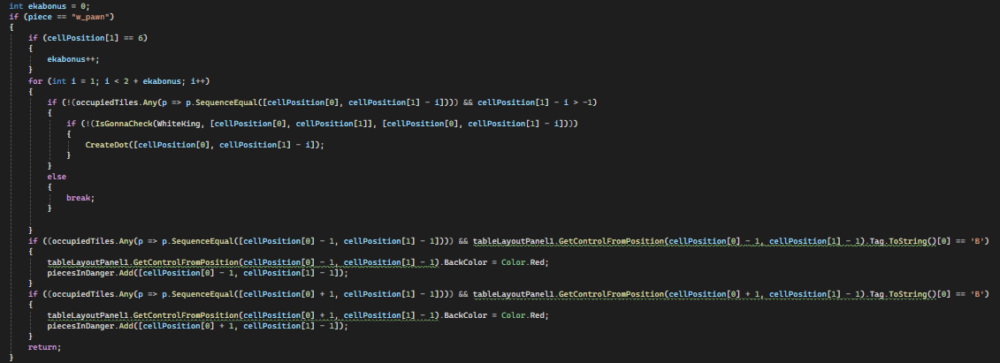

# Shakki

Tämä on peli on klassinen shakki ilman erikoissiirtoja tornitus ja en passant, eikä sotilaita voi muuttaa toisiksi 
nappuloiksi viemellä ne laudan päähän. Peli alkaa, kun painaa Aloite peli-napista. Nappuloita liikutetaan painamalla
nappulaa ja sitten pinamalla jotain mahdollista ruutua liikkua, jotka ovat joko pisteellä merkittyjä tyhjiä ruutuja
tai punataustaisia vastustajan nappuloita. Aina kun jomman kumman kuningas on shakissa, kuninkaalle tulee punainen
tausta. Peli päättyy shakkimattiin, jolloin Aloita peli-nappulan ylle ilmestyy sana "Checkmate".

## Koodin esittely

Jokaisella nappulalla on hyvin samankaltaiset click-eventhandlerit:

Eka if estää nappulaa liikkumasta ennen kuin peli alkaa, toinen vastaa liikkumisprosessin aloittamisesta omalla
vuorolla ja kolmas kun vihollisen nappula syö oman nappula.

ClickingPiece on pitkä funktio, joka näyttää mihin klikattava nappula voi liikkua luomalla pisteitä kartalle ja 
muuttamalla napattavien vastustajan nappuloiden taustavärin punaiseksi. DeleteMoveSignals pyyhkii aiemmat tällaiset 
merkinnät.

