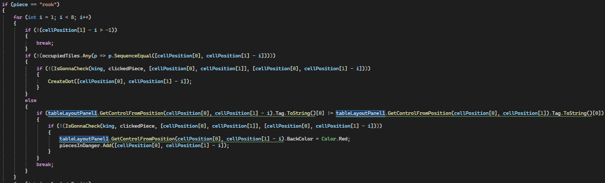
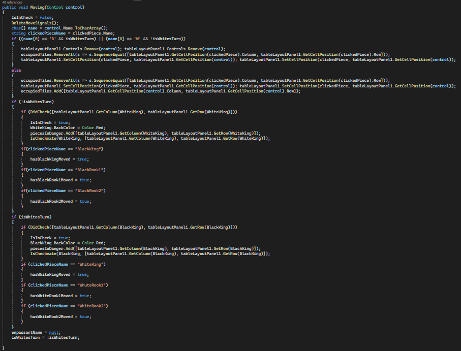

# Shakki

Tämä on peli on klassinen shakki ilman erikoissiirtoja tornitus ja en passant, eikä sotilaita voi muuttaa toisiksi 
nappuloiksi viemellä ne laudan päähän. Peli alkaa, kun painaa Aloite peli-napista. Nappuloita liikutetaan painamalla
nappulaa ja sitten pinamalla jotain mahdollista ruutua liikkua, jotka ovat joko pisteellä merkittyjä tyhjiä ruutuja
tai punataustaisia vastustajan nappuloita. Aina kun jomman kumman kuningas on shakissa, kuninkaalle tulee punainen
tausta. Peli päättyy shakkimattiin, jolloin Aloita peli-nappulan ylle ilmestyy sana "Checkmate".

## Koodin esittely

Jokaisella nappulalla on hyvin samankaltaiset click-eventhandlerit:

Eka if estää nappulaa liikkumasta ennen kuin peli alkaa, toinen vastaa liikkumisprosessin aloittamisesta omalla
vuorolla ja kolmas kun vihollisen nappula syö oman nappula.

ClickingPiece on pitkä funktio, joka näyttää mihin klikattava nappula voi liikkua luomalla pisteitä kartalle ja 
muuttamalla napattavien vastustajan nappuloiden taustavärin punaiseksi. DeleteMoveSignals pyyhkii aiemmat tällaiset 
merkinnät.

Piece argumentti kertoo nappulan tyypin ja cellPosition nappulan sijainnin laudalla. Tässä on tornin liikkuminen.
Ihan aluksi for-loopissa varmistetaan, ettei testattava ruutu ole laudan ulkopuolella. Sen jälkeen katsotaan
occupiedTiles-listasta, onko ruudulla joku noppula. Jos ei ole, pitää vielä varmistaa IsGonnaCheck-funktiolla,
ettei siirto veisi omaa kuningasta shakkiin tai jääkö kuningas shakkiin. Jos ei, niin laudalle ilmestyy piste, jota 
klikkaamalla nappula liikkuu ruutuun. Jos ruudulla onkin toinen nappula tiellä, niin katsotaan onko vastustajan vai 
oma nappula nappulan tagista. Jokaisella nappulalla on tagi, jonka eka kirjain kertoo nappulan värin ja toinen tyypin. 
Jos on vastustajan nappula, niin vielä varmistetaan ettei liike shakita omaa kuningasta, ennenkuin merkitään nappula 
napattavaksi vaihtamalla sen taustaväriä punaiseksi.

Eri nappuloiden liikkeiden hoitaminen vie paljon tilaa, tässä vain tornin liikkeiden hoito. Fuktio vie lähemmäs 500
riviä tilaa.

Moving-funktiota kutsutaan aina pistettä painettaessa tai napattavaa vastustajan nappulaa painettaessa. Aluksi
suoritetaan DeleteMoveSignals, jonka jälkeen hoidetaan nappuloiden liikkeet laudalla (tableLayoutPanel1) ja muokataan
occupiedTiles-lista paikkaansa pitäväksi. Sen jälkeen tarkistetaan shakitettiinko vastustajan kuningasta ja jos
shakitettiin, niin syntyikö shakkimatti. Lopuksi vaihdetaan vuoroa muuttamalla globaalin isWhitesTurn-muuttujan arvoa.

DidCheck-funtkio etsii joka suunnasta mahdollisia vastustajan shakittavia nappuloita aloitten hevosista, lisäten löydetyt
globaaliin muuttujaan checkingPieces, jonka arvon mukaan funktio palauttaa joka truen tai falsen.

Ihan aluksi funktiossa tallentaan checkingPieces-muuttujan arvo toiseen muuttujaan, koska checkingPieces-arvo saattaa
muuttua funktion aikana. clickedPiecen arvo puolestaan vaihdetaan hypoteettisista syistä. Jos shakkittavia nappuloita
on vain yksi, niin funktio tarkistaa voiko shakittavan nappulan napata ja nappulan tyyppiä hyödyntäen voiko uhan blockata.
Funktio palautuu heti kun yksikin vaihtoehto löytyy.

CanTake ja CanBlock muistuttavat DidCheck-funktiota, kun DidCheckissä etsitään shakittavia nappuloita niin CanTakessa
etsitään nappuloita, jotka ovat valmiina syömään shakittavan nappulan ja CanBlockissa etsitään valmiina blockkaamaan
olevia nappuloita. Silloin kun DidChekissä lisättiin checkingPieces-listaan nappuloita niin CanTake ja CanBlock 
palauttavat truen ja palauttavat falsen funktion loppuun päästessä.

Jos shakittavia nappuloita on enemmän kuin yksi, niin funktio tarkistaa vain onko kuninkaalle paettavaa ruutua. Jos 
funktio palaudu missään vaiheessa niin "Checkmate" teksti ilmestyy ja koska jokainen mahdollinen liike jättäisi kuniinkaan
shakkiin ei mitään liikettä voi enää suorittaa. Peli on päättynyt ja sen voi aloittaa uudestaan käynistämällä ohjelma
uudestaan.
