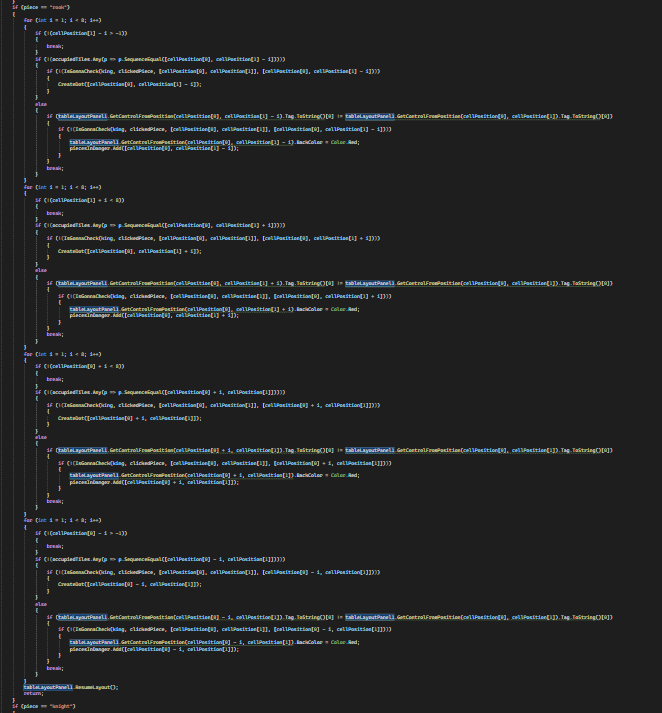

# Shakki

Tämä on peli on klassinen shakki ilman ett sotilaita voi muuttaa toisiksi nappuloiksi viemellä ne laudan päähän. Peli 
alkaa, kun painaa Aloita peli-napista. Nappuloita liikutetaan painamalla nappulaa ja sitten pinamalla jotain mahdollista 
ruutua liikkua, jotka ovat joko pisteellä merkittyjä tyhjiä ruutuja tai punataustaisia vastustajan nappuloita. Aina kun 
jomman kumman kuningas on shakissa, kuninkaalle tulee punainen tausta. Peli päättyy shakkimattiin, jolloin Aloita peli-
nappulan ylle ilmestyy sana "Checkmate". Uuden pelin voi aloittaa painamalla Aloita peli-nappia uudestaan.

## Vuokaavio

Tein vuokaavion funktiopohjaisesti ajattelematta C#:n olioita tai windowsformsin eventtejä. Suunnitelmat muuuttuivat
koodia kirjoittaessa enkä katsonut vuokaaviost mallia koska tein ja tallensin sen toisella läppärillä.

## Esittelyvideot

(Uusimmassa versioissa näyttö ei "näpähtele" niin paljon kuin videossa)

https://github.com/Kuuho12/CSharpNayttotyo/assets/106885770/679b5b90-92b6-4b26-b7af-ad4f36b73857

https://github.com/Kuuho12/CSharpNayttotyo/assets/106885770/144f1956-71e8-4cd7-851e-0eaa89b05ef6

https://github.com/Kuuho12/CSharpNayttotyo/assets/106885770/591a4ae6-de84-4ffe-af76-14e316c17354

## Koodin esittely

Jokaisella nappulalla on hyvin samankaltaiset click-eventhandlerit:

Eka if estää nappulaa liikkumasta ennen kuin peli alkaa, toinen vastaa liikkumisprosessin aloittamisesta omalla
vuorolla ja kolmas kun vihollisen nappula syö oman nappula.

ClickingPiece on pitkä funktio, joka näyttää mihin klikattava nappula voi liikkua luomalla pisteitä kartalle ja 
muuttamalla napattavien vastustajan nappuloiden taustavärin punaiseksi. DeleteMoveSignals pyyhkii aiemmat tällaiset 
merkinnät.

Piece argumentti kertoo nappulan tyypin ja cellPosition nappulan sijainnin laudalla. Tässä on tornin liikkuminen.
Ihan aluksi for-loopissa varmistetaan, ettei testattava ruutu ole laudan ulkopuolella. Sen jälkeen katsotaan
occupiedTiles-listasta, onko ruudulla joku noppula. Jos ei ole, pitää vielä varmistaa IsGonnaCheck-funktiolla,
ettei siirto veisi omaa kuningasta shakkiin tai jääkö kuningas shakkiin. Jos ei, niin laudalle ilmestyy piste, jota 
klikkaamalla nappula liikkuu ruutuun. Jos ruudulla onkin toinen nappula tiellä, niin katsotaan onko vastustajan vai 
oma nappula nappulan tagista. Jokaisella nappulalla on tagi, jonka eka kirjain kertoo nappulan värin ja toinen tyypin. 
Jos on vastustajan nappula, niin vielä varmistetaan ettei liike shakita omaa kuningasta, ennenkuin merkitään nappula 
napattavaksi vaihtamalla sen taustaväriä punaiseksi.

Eri nappuloiden liikkeiden hoitaminen vie paljon tilaa, tässä vain tornin liikkeiden hoito. Fuktio vie lähemmäs 500
riviä tilaa.

IsGonnaCheck-funktio tekee muutoksia laudalla (tableLayoutPanel1) ja occupiedTiles-listaan kyseisen liikkeen mukaan ja
tarkistaa sen jälkeen DidCheck-funktiolla johtaisiko liike oman kuninkaan shakkiin. Jos johtaa shakkiin, niin funktio
palauttaa truen, jos ei niin falsen. Koska funtkio tekee muutoksia pelilaudalla eikä vaikka "pelilaudan varjolla" niin
funktio on hidas.

Moving-funktiota kutsutaan aina pistettä painettaessa tai napattavaa vastustajan nappulaa painettaessa. Aluksi
suoritetaan DeleteMoveSignals, jonka jälkeen hoidetaan nappuloiden liikkeet laudalla ja muokataan
occupiedTiles-lista paikkaansa pitäväksi. Sen jälkeen tarkistetaan shakitettiinko vastustajan kuningasta ja jos
shakitettiin, niin syntyikö shakkimatti. Lopuksi vaihdetaan vuoroa muuttamalla globaalin isWhitesTurn-muuttujan arvoa.

DidCheck-funtkio etsii joka suunnasta mahdollisia vastustajan shakittavia nappuloita aloitten hevosista, lisäten löydetyt
globaaliin muuttujaan checkingPieces, jonka arvon mukaan funktio palauttaa joka truen tai falsen.

Ihan aluksi funktiossa tallentaan checkingPieces-muuttujan arvo toiseen muuttujaan, koska checkingPieces-arvo saattaa
muuttua funktion aikana. clickedPiecen arvo puolestaan vaihdetaan hypoteettisista syistä. Jos shakkittavia nappuloita
on vain yksi, niin funktio tarkistaa voiko shakittavan nappulan napata ja nappulan tyyppiä hyödyntäen voiko uhan blockata.
Funktio palautuu heti kun yksikin vaihtoehto löytyy.

CanTake ja CanBlock muistuttavat DidCheck-funktiota, kun DidCheckissä etsitään shakittavia nappuloita niin CanTakessa
etsitään nappuloita, jotka ovat valmiina syömään shakittavan nappulan ja CanBlockissa etsitään valmiina blockkaamaan
olevia nappuloita. Silloin kun DidChekissä lisättiin checkingPieces-listaan nappuloita niin CanTake ja CanBlock 
palauttavat truen ja palauttavat falsen funktion loppuun päästessä.

Jos shakittavia nappuloita on enemmän kuin yksi, niin funktio tarkistaa vain onko kuninkaalle paettavaa ruutua. Jos 
funktio palaudu missään vaiheessa niin "Checkmate" teksti ilmestyy ja koska jokainen mahdollinen liike jättäisi kuniinkaan
shakkiin ei mitään liikettä voi enää suorittaa. Peli on päättynyt ja sen voi aloittaa uudestaan käynistämällä ohjelma
uudestaan.

## Jatkokehitysideat

Kun koodissa testataan joutuisiko oma kuninkaasi shakkiin jos sitä liikutetaan johonkin ruutuun IsGonnaCheck-funktiolla, 
koodi oikeasti siirtää hetken ajaksi nappulan siihen ruutuun, tuhlaten paljon tehoa. Tämä kannattaisi muuttaa, eikä
IsGonnaCheck-funktiota kannattaisi muutenkaan spammia joka ruudulle. Sotilaan parantaminen toiseksi nappulaksi viemällä 
sen laudan toiseen laitaan voisi lisätä peliin. Pelitulokset voisi tallentaa tiedostoon. Peliin voisi lisätä myös kellot 
kummallenkin pelaajalle, josta kuluu aikaa omalla vuorolla ja kellon ajan loppuessa häviäisit. Myös "Pelaa' uudestaan"-
nappula olisi hyvä lisäys.
